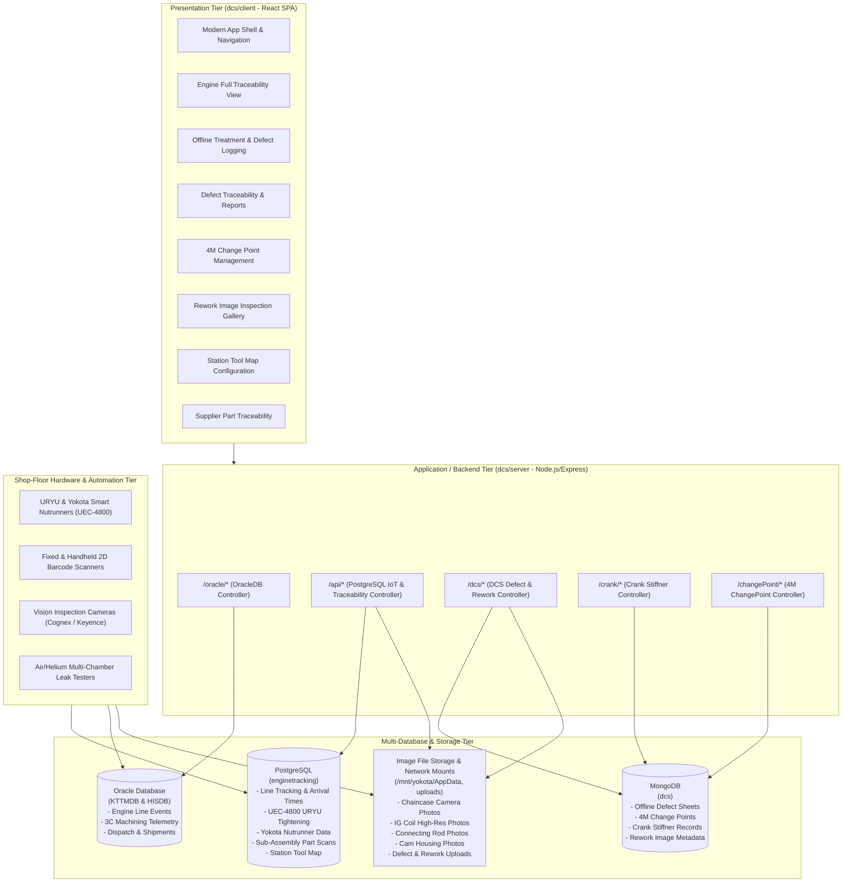

# DCS (Data Collection System) — Complete System Architecture & Frontend Modernization Specification

---

## 1. Executive Summary & Purpose

The **Data Collection System (DCS)** is the mission-critical **Manufacturing Execution and Quality Traceability System (MES/QMS)** deployed for automotive engine production at **Toyota / TIEI India**.

DCS provides end-to-end digital genealogy and quality assurance for every manufactured engine across three primary shop-floor domains:
1. **Machining Line (3C Parts)**: Cylinder Block, Cylinder Head, and Crankshaft machining, laser cladding, and multi-chamber leak testing.
2. **Sub-Assembly & Part Traceability**: Automated capture of critical component serial numbers, tightening parameters, and high-resolution vision camera inspection photos.
3. **Main Assembly Line, Quality Gates & 4M Management**: Tightening torque validation (URYU & Yokota IoT nutrunners), offline defect treatment sheets with barcode scanning, rework tracking, and 4M (Man, Machine, Material, Method) change point monitoring.

---

## 2. End-to-End System Architecture



---

## 3. Target Modern React Architecture with `.jsx` Refactoring

### 3.1 Separation of Concerns: `.jsx` (UI) vs `.js` (Pure Logic)
- **All React UI components, Layouts, Screens, Modals, and Tables** are refactored into **modern `.jsx` format**.
- **Pure business logic, decoders, API services, and Redux slices** remain in clean **`.js` modules**.

```text
client/src/
├── api/                            # Pure JS (.js) - Centralized API Layer
│   ├── apiClient.js                # Configured Axios instance with retry/interceptors
│   ├── oracleApi.js                # Oracle DB endpoints
│   ├── postgresApi.js              # PostgreSQL IoT & Traceability endpoints
│   ├── dcsApi.js                   # DCS Defect & Rework Image endpoints
│   ├── crankApi.js                 # Crank Stiffner endpoints
│   └── changePointApi.js           # 4M Change Point endpoints
│
├── components/                     # Refactored React Components (.jsx)
│   ├── common/                     # Reusable Modern UI Kit (.jsx)
│   │   ├── DataTable.jsx           # High-performance sorted/paginated table
│   │   ├── MetricCard.jsx          # KPI card for cycle time, torque, counts
│   │   ├── StatusBadge.jsx         # OK / NG / LL / UL / ERR badges
│   │   ├── LightboxModal.jsx       # Zoomable image lightbox modal
│   │   ├── SkeletonLoader.jsx      # Shimmer loading placeholders
│   │   ├── SearchBar.jsx           # Debounced search bar with icons
│   │   └── ConfirmDialog.jsx       # Clean modal confirmation dialog
│   │
│   ├── layout/                     # Application Shell (.jsx)
│   │   ├── AppLayout.jsx           # Responsive layout container
│   │   ├── Topbar.jsx              # Header with logo, page title, status indicator
│   │   └── Sidebar.jsx             # Modern navigation sidebar
│   │
│   ├── traceability/               # Engine Traceability Domain Components (.jsx)
│   │   ├── AssemblySection.jsx     # Shipment & Main line station history
│   │   ├── MachiningSection.jsx    # Block, Head, Crank decoded telemetry
│   │   ├── TighteningSection.jsx   # URYU & Yokota nutrunner torque tables
│   │   ├── PartTraceabilityGrid.jsx# Sub-assembly part cards + vision photos
│   │   ├── CrankInfoCard.jsx       # Crank housing stiffner details
│   │   └── ExportButton.jsx        # Lazy-loaded ExcelJS dossier exporter
│   │
│   ├── defectForm/                 # Assembly Offline Treatment (.jsx)
│   │   ├── DefectEntryForm.jsx     # Form with taxonomy & spatial inputs
│   │   ├── BarcodeScannerModal.jsx # Camera barcode scanner (@ericblade/quagga2)
│   │   ├── DefectPhotoUpload.jsx   # Multipart camera photo preview
│   │   └── PqcsChecklist.jsx       # PQCS checklist items
│   │
│   ├── changePoints/               # 4M Change Point Management (.jsx)
│   │   ├── ChangePointGrid.jsx     # 4M Table with pagination controls
│   │   ├── ChangePointModal.jsx    # Entry & editing modal
│   │   └── ChangePointFilters.jsx  # Station, date, shift filter bar
│   │
│   ├── reworkImages/               # Rework & Vision Gallery (.jsx)
│   │   ├── ReworkImageGallery.jsx  # Card grid with thumbnail previews
│   │   └── ReworkFilterBar.jsx     # Plant, shift, date filter bar
│   │
│   └── toolConfig/                 # Station Tool Administration (.jsx)
│       ├── ToolMapTable.jsx        # Station, folder, tool name table
│       └── ToolMapModal.jsx        # Add / edit mapping modal
│
├── screens/                        # Top-level View Screens (.jsx)
│   ├── EngineTraceabilityScreen.jsx# Route: /
│   ├── SupplierTraceabilityScreen.jsx# Route: /supplierPartDeatils
│   ├── DefectFormScreen.jsx        # Route: /add-form
│   ├── DefectReportsScreen.jsx     # Route: /traceability
│   ├── ChangePointsScreen.jsx      # Route: /changePoints
│   ├── ReworkGalleryScreen.jsx     # Route: /searchReworkImages
│   └── ToolConfigScreen.jsx        # Route: /edit-tool-details
│
├── redux/                          # Pure JS (.js) - State Management
│   ├── store.js
│   └── slices/
│       ├── traceabilitySlice.js
│       ├── defectSlice.js
│       ├── changePointSlice.js
│       └── toolMapSlice.js
│
├── utils/                          # Pure JS (.js) - Utilities & Decoders
│   ├── decoders/
│   │   ├── decodeBlock235.js       # Cylinder block multi-plug leak decoder
│   │   ├── decodeHead50.js         # Laser cladding powder flow rate decoder
│   │   ├── decodeHead310.js        # 4-chamber head leak test decoder
│   │   ├── decodeCrank150.js       # Crankshaft process decoder
│   │   └── decodeHeadBoltNR.js     # Head bolt nutrunner torque decoder
│   ├── dateUtils.js                # Shift-safe local date formatting
│   └── excelExport.js              # Multi-table ExcelJS workbook generator
│
├── styles/                         # CSS Design System
│   ├── variables.css               # Design tokens (Colors, Typography, Spacing)
│   ├── components.css              # Shared UI Kit styling
│   └── global.css                  # Global resets
│
├── App.jsx                         # Main Router Shell (.jsx)
└── index.js                        # App Bootstrap (.js)
```

---

## 4. Legacy-to-JSX Conversion Mapping

| Legacy Component | New Modern JSX Component | Purpose |
| :--- | :--- | :--- |
| `App.js` | [`App.jsx`](file:///c:/Users/Priyanka/OfficeProjects/dcs/client/src/App.js) | Main router shell with React Suspense code-splitting |
| `components/Sidebar.js` | `components/layout/Sidebar.jsx` | Responsive navigation drawer (replaces Semantic UI) |
| `components/NavBar.js` | `components/layout/Topbar.jsx` | Responsive header with Toyota brand & live status |
| `components/engno/MainPage.js` | `screens/EngineTraceabilityScreen.jsx` | Decomposed search container for engine profile |
| `components/engno/Entire.js` (2,176 lines) | `components/traceability/*.jsx` | 5 modular JSX components (Assembly, Machining, Tightening, Parts, Export) |
| `components/part_traceability/pt_table.js` (1,367 lines) | `components/traceability/PartTraceabilityGrid.jsx` | Schema-driven dynamic part card with lightbox zoom |
| `components/DefectForm/DefectForm.js` | `components/defectForm/DefectEntryForm.jsx` | Defect form with Quagga camera barcode scanner |
| `screens/DefectTraceabilityScreen.js` | `screens/DefectReportsScreen.jsx` | Non-conformance reporting table with modal inspection |
| `components/changePoints/ChangePoints.js` | `screens/ChangePointsScreen.jsx` | 4M Change point sheet with server-side pagination |
| `components/reworkImage/SearchReworkImages.js` | `screens/ReworkGalleryScreen.jsx` | Plant & shift rework gallery with photo modal |
| `components/editToolDetails/editToolDetails.js` | `screens/ToolConfigScreen.jsx` | PostgreSQL station-to-tool configuration manager |
| `components/crank/CrankInfo.js` | `components/traceability/CrankInfoCard.jsx` | Crank housing stiffner info card |
| `components/engno/DetailTraceability.js` (863 lines) | `screens/SupplierTraceabilityScreen.jsx` | Upstream supplier part and casting batch analysis |

---

## 5. Zero-Backend-Impact API Matrix

Every single backend API contract, route parameter, query string, payload structure, and database response is preserved with **100% backward compatibility**:

| Backend Router | Route Pattern | HTTP Verb | Refactored Component Consumer |
| :--- | :--- | :--- | :--- |
| **Oracle** | `/oracle/engineNo/:engineNo` | GET | `api/oracleApi.js` -> `EngineTraceabilityScreen.jsx` |
| | `/oracle/partNo/:partNo` | GET | `api/oracleApi.js` -> `MachiningSection.jsx` |
| | `/oracle/partNo1/:p1/partNo2/:p2/partNo3/:p3` | GET | `api/oracleApi.js` -> `MachiningSection.jsx` |
| | `/oracle/processNo/:p/fromDate/:f/toDate/:t` | GET | `api/oracleApi.js` -> `SupplierTraceabilityScreen.jsx` |
| | `/oracle/getFullDataAssy/:p/fromDate/:f/toDate/:t` | GET | `api/oracleApi.js` -> `SupplierTraceabilityScreen.jsx` |
| | `/oracle/serialNoListString` | POST | `api/oracleApi.js` -> Serial Number Lookup |
| | `/oracle/dispatchDates/engineNoListString` | POST | `api/oracleApi.js` -> Shipment Date Lookup |
| **PostgreSQL** | `/api/impactWrench/:engineNo` | GET | `api/postgresApi.js` -> `TighteningSection.jsx` |
| | `/api/yokota/:engineNo` | GET | `api/postgresApi.js` -> `TighteningSection.jsx` |
| | `/api/station-tool-map` | GET, POST | `api/postgresApi.js` -> `ToolConfigScreen.jsx` |
| | `/api/station-tool-map/:station/:folder` | PUT, DELETE | `api/postgresApi.js` -> `ToolConfigScreen.jsx` |
| | `/api/ig_coil_chain_cover/:engineNo` | GET | `api/postgresApi.js` -> `PartTraceabilityGrid.jsx` |
| | `/api/connecting_rod/:engineNo` | GET | `api/postgresApi.js` -> `PartTraceabilityGrid.jsx` |
| | `/api/chaincase/:engineNo` | GET | `api/postgresApi.js` -> `PartTraceabilityGrid.jsx` |
| | `/api/chaincover/:engineNo` | GET | `api/postgresApi.js` -> `PartTraceabilityGrid.jsx` |
| | `/api/fueldeliverypipe/:engineNo` | GET | `api/postgresApi.js` -> `PartTraceabilityGrid.jsx` |
| | `/api/pcv/:engineNo` | GET | `api/postgresApi.js` -> `PartTraceabilityGrid.jsx` |
| | `/api/wireharness/:engineNo` | GET | `api/postgresApi.js` -> `PartTraceabilityGrid.jsx` |
| | `/api/camhousing/:camhousingSN` | GET | `api/postgresApi.js` -> `PartTraceabilityGrid.jsx` |
| | `/api/portinjector/:headSN` | GET | `api/postgresApi.js` -> `PartTraceabilityGrid.jsx` |
| | `/api/chaincase-image/:engineNo` | GET | `api/postgresApi.js` -> `PartTraceabilityGrid.jsx` |
| | `/api/ig-coil-images/:engineNo` | GET | `api/postgresApi.js` -> `PartTraceabilityGrid.jsx` |
| | `/api/ig-coil-images/:engineNo/:idx` | GET | `api/postgresApi.js` -> `PartTraceabilityGrid.jsx` |
| | `/api/connecting-rod-images/:engineNo` | GET | `api/postgresApi.js` -> `PartTraceabilityGrid.jsx` |
| | `/api/connecting-rod-images/:engineNo/:idx` | GET | `api/postgresApi.js` -> `PartTraceabilityGrid.jsx` |
| | `/api/camhousing-image/:camhousingSN` | GET | `api/postgresApi.js` -> `PartTraceabilityGrid.jsx` |
| | `/api/chaincover-image/:engineNo` | GET | `api/postgresApi.js` -> `PartTraceabilityGrid.jsx` |
| **DCS (MongoDB)** | `/dcs/dcs-form` | POST | `api/dcsApi.js` -> `DefectEntryForm.jsx` |
| | `/dcs/dcs-forms` | GET | `api/dcsApi.js` -> `DefectReportsScreen.jsx` |
| | `/dcs/dcs-form/upload-image` | POST (multipart) | `api/dcsApi.js` -> `DefectPhotoUpload.jsx` |
| | `/dcs/reworkImages` | POST (multipart) | `api/dcsApi.js` -> `ReworkImageGallery.jsx` |
| | `/dcs/reworkImagesMultiple` | POST (multipart) | `api/dcsApi.js` -> `ReworkImageGallery.jsx` |
| | `/dcs/reworkImages/:imageName` | GET | `api/dcsApi.js` -> `ReworkImageGallery.jsx` |
| | `/dcs/reworkImagesListQuery` | GET | `api/dcsApi.js` -> `ReworkGalleryScreen.jsx` |
| **Crank** | `/crank/crankinformation/:engineNo` | GET, PUT, DELETE | `api/crankApi.js` -> `CrankInfoCard.jsx` |
| | `/crank/crankinfo` | GET, POST | `api/crankApi.js` -> `CrankInfoCard.jsx` |
| **ChangePoint** | `/changePoint/getAllChangePoints` | GET | `api/changePointApi.js` -> `ChangePointsScreen.jsx` |
| | `/changePoint/add`, `/update/:id`, `/delete/:id` | POST, PUT, DELETE | `api/changePointApi.js` -> `ChangePointModal.jsx` |
| | `/changePoint/getChangePointsCount` | GET | `api/changePointApi.js` -> `ChangePointsScreen.jsx` |
